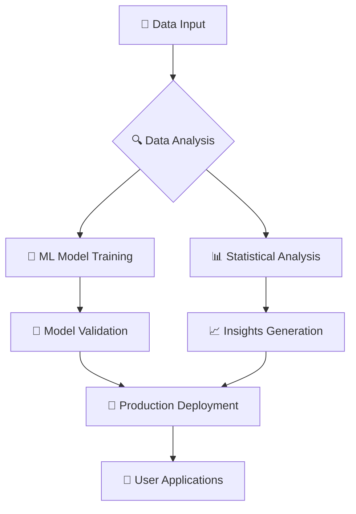
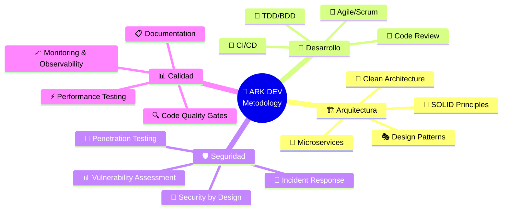
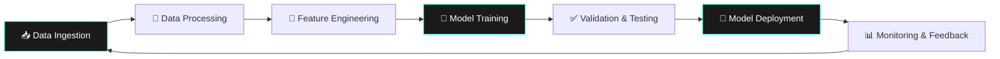

<div align="center">
<picture>
  <source media="(prefers-color-scheme: dark)" srcset="https://arkdev.pages.dev/src/1001136218removebgpreview.png">
  <source media="(prefers-color-scheme: light)" srcset="https://arkdev.pages.dev/src/1001136218removebgpreview.png">
  
</picture>
<a href="https://git.io/typing-svg">
  
</a>

[](https://github.com/ark-dev)  
[](https://arkdev.pages.dev)  
[](https://arkdev.pages.dev)  

<details>
<summary>🧭 <strong>Navegación Rápida</strong></summary>

| 🎯 Sección | 📌 Enlace Directo |
|-------------|-------------------|
| 🚀 Sobre Mí | [Ver perfil](#-sobre-mí) |
| 💼 Servicios | [Explorar](#-servicios--especialidades) |
| 🛠️ Tech Stack | [Tecnologías](#%EF%B8%8F-arsenal-tecnológico) |
| 📊 Estadísticas | [GitHub Stats](#-github-analytics) |
| 📱 Contacto | [Conectar](#-conecta-conmigo) |

</details>

</div>

---

## 🌟 Sobre Mí

<div align="center">

> [!NOTE]
> 🎯 **Transformando ideas en soluciones tecnológicas innovadoras**

</div>

```ascii
╔═══════════════════════════════════════╗
║  🧑‍💻 Joel Andrés - ARK DEV Founder      ║
║  📍 Ubicación: La Paz, Bolivia        ║
║  🎓 Ingeniero de Sistemas             ║
║  📅 Empresa fundada: Abril 2024       ║
╚═══════════════════════════════════════╝
```

**ARK DEV** no es solo una empresa, es una **revolución tecnológica** 🚀. Desde abril de 2024, lidera un equipo multidisciplinario especializado en:

<table>
<tr>
<td width="50%">

### 🎯 **Mi Misión**
Crear soluciones tecnológicas que **trascienden expectativas**, combinando:
- **Innovación** constante
- **Calidad** excepcional  
- **Seguridad** de nivel enterprise
- **Experiencia** de usuario memorable

</td>
<td width="50%">

### ⚡ **Mi Filosofía** 
```python
def codigo_perfecto():
    while True:
        innovar()
        optimizar()
        securizar()
        entregar_excelencia()
        # Never stop improving 🔄
```

</td>
</tr>
</table>

---

## 💼 Servicios & Especialidades

<div align="center">

> [!TIP]
> 💡 **Cada proyecto es una oportunidad de crear algo extraordinario**

</div>

### 🏗️ **Desarrollo Full-Stack Premium**

<details>
<summary>🌐 <strong>Frontend Avanzado</strong></summary>

- **⚛️ React Ecosystem**: Next.js 14+, Server Components, App Router
- **🎨 Styling Modern**: Tailwind CSS, Framer Motion, GSAP
- **📱 Responsive**: Mobile-first, Progressive Web Apps (PWA)
- **🔥 Performance**: Lighthouse 100/100, Core Web Vitals optimization

```typescript
// Ejemplo de componente React optimizado
const ModernComponent: FC = () => {
  const { data, isLoading } = useQuery('endpoint', fetcher);
  
  return (
    <motion.div 
      initial={{ opacity: 0, y: 20 }}
      animate={{ opacity: 1, y: 0 }}
      transition={{ duration: 0.6 }}
    >
      {/* UI components here */}
    </motion.div>
  );
};
```

</details>

<details>
<summary>⚙️ <strong>Backend Robusto</strong></summary>

- **🔧 APIs RESTful/GraphQL**: Laravel, .NET Core, Node.js
- **🗄️ Bases de Datos**: PostgreSQL, MySQL, MongoDB, Redis
- **☁️ Microservicios**: Docker, Kubernetes, Service Mesh
- **🔐 Autenticación**: JWT, OAuth 2.0, Multi-factor

```php
// Laravel API con performance optimizada
class OptimizedController extends Controller 
{
    public function index(Request $request): JsonResponse
    {
        return Cache::tags(['api', 'users'])
            ->remember('users.paginated', 3600, function () use ($request) {
                return UserResource::collection(
                    User::with(['roles', 'permissions'])
                        ->paginate($request->get('per_page', 15))
                );
            });
    }
}
```

</details>

### 🛡️ **Ciberseguridad Enterprise**

<details>
<summary>🔍 <strong>Pentesting & Auditorías</strong></summary>

| 🎯 Especialidad | 📋 Servicios |
|-----------------|---------------|
| **Web Application** | OWASP Top 10, SQL Injection, XSS, CSRF |
| **Network Security** | Vulnerability Assessment, Port Scanning |
| **Mobile Security** | Android/iOS App Security Testing |
| **Infrastructure** | Server Hardening, Configuration Review |

> [!WARNING]
> 🚨 **El 95% de las brechas de seguridad son evitables con las medidas correctas**

</details>

<details>
<summary>🚨 <strong>SOC & Incident Response</strong></summary>

- **🔍 Monitoreo 24/7**: SIEM implementation, Log analysis
- **⚡ Respuesta Rápida**: Incident classification, Forensics
- **📊 Threat Intelligence**: IOC analysis, Attack pattern recognition
- **🛠️ Recovery**: Business continuity, Disaster recovery plans

</details>

### 🤖 **Inteligencia Artificial & ML**

<div align="center">



</div>

<details>
<summary>🧠 <strong>Machine Learning Solutions</strong></summary>

- **🔮 Predictive Analytics**: TensorFlow, PyTorch, Scikit-learn
- **💬 NLP & Chatbots**: OpenAI Integration, Custom Language Models
- **👁️ Computer Vision**: Image recognition, Object detection
- **📈 Business Intelligence**: Data pipelines, Automated reporting

```python
# Modelo de ML optimizado para producción
import tensorflow as tf
from tensorflow.keras.optimizers import AdamW

def create_advanced_model(input_shape, num_classes):
    model = tf.keras.Sequential([
        tf.keras.layers.Conv2D(64, 3, activation='relu', input_shape=input_shape),
        tf.keras.layers.BatchNormalization(),
        tf.keras.layers.Dropout(0.3),
        tf.keras.layers.GlobalAveragePooling2D(),
        tf.keras.layers.Dense(num_classes, activation='softmax')
    ])
    
    model.compile(
        optimizer=AdamW(learning_rate=0.001),
        loss='categorical_crossentropy',
        metrics=['accuracy', 'top_k_categorical_accuracy']
    )
    return model
```

</details>

---

## 🛠️ Arsenal Tecnológico

<div align="center">

> [!IMPORTANT]
> 🎨 **Dominio completo del stack moderno - desde el pixel hasta el servidor**

</div>

### 🎨 **Frontend & UX/UI**

<table align="center">
<tr>
<td align="center" width="100">

<br><sub><strong>React</strong></sub>
</td>
<td align="center" width="100">

<br><sub><strong>Next.js</strong></sub>
</td>
<td align="center" width="100">

<br><sub><strong>TypeScript</strong></sub>
</td>
<td align="center" width="100">

<br><sub><strong>Tailwind CSS</strong></sub>
</td>
<td align="center" width="100">

<br><sub><strong>Figma</strong></sub>
</td>
</tr>
</table>

### ⚙️ **Backend & Infrastructure**

<table align="center">
<tr>
<td align="center" width="100">

<br><sub><strong>Laravel</strong></sub>
</td>
<td align="center" width="100">

<br><sub><strong>.NET Core</strong></sub>
</td>
<td align="center" width="100">

<br><sub><strong>Node.js</strong></sub>
</td>
<td align="center" width="100">

<br><sub><strong>Docker</strong></sub>
</td>
<td align="center" width="100">

<br><sub><strong>Kubernetes</strong></sub>
</td>
</tr>
</table>

### 🗄️ **Bases de Datos & Storage**

<table align="center">
<tr>
<td align="center" width="100">

<br><sub><strong>PostgreSQL</strong></sub>
</td>
<td align="center" width="100">

<br><sub><strong>MySQL</strong></sub>
</td>
<td align="center" width="100">

<br><sub><strong>MongoDB</strong></sub>
</td>
<td align="center" width="100">

<br><sub><strong>Redis</strong></sub>
</td>
<td align="center" width="100">

<br><sub><strong>Elasticsearch</strong></sub>
</td>
</tr>
</table>

### ☁️ **Cloud & DevOps**

<table align="center">
<tr>
<td align="center" width="100">

<br><sub><strong>AWS</strong></sub>
</td>
<td align="center" width="100">

<br><sub><strong>Azure</strong></sub>
</td>
<td align="center" width="100">

<br><sub><strong>GCP</strong></sub>
</td>
<td align="center" width="100">

<br><sub><strong>GitHub Actions</strong></sub>
</td>
<td align="center" width="100">

<br><sub><strong>Terraform</strong></sub>
</td>
</tr>
</table>

### 📱 **Mobile & Desktop**

<table align="center">
<tr>
<td align="center" width="100">

<br><sub><strong>Flutter</strong></sub>
</td>
<td align="center" width="100">

<br><sub><strong>Kotlin</strong></sub>
</td>
<td align="center" width="100">

<br><sub><strong>Swift</strong></sub>
</td>
<td align="center" width="100">

<br><sub><strong>Electron</strong></sub>
</td>
<td align="center" width="100">

<br><sub><strong>WinUI 3</strong></sub>
</td>
</tr>
</table>

### 🤖 **IA & Machine Learning**

<table align="center">
<tr>
<td align="center" width="100">

<br><sub><strong>TensorFlow</strong></sub>
</td>
<td align="center" width="100">

<br><sub><strong>PyTorch</strong></sub>
</td>
<td align="center" width="100">

<br><sub><strong>Python</strong></sub>
</td>
<td align="center" width="100">

<br><sub><strong>OpenCV</strong></sub>
</td>
<td align="center" width="100">

<br><sub><strong>Hugging Face</strong></sub>
</td>
</tr>
</table>

---

## 🎯 Proyectos Destacados

<div align="center">

> [!IMPORTANT]
> 🏆 **Portfolio de soluciones que marcan la diferencia**

</div>

### 🌟 **ARK DEV Ecosystem**

<table>
<tr>
<td width="33%">

#### 🌐 [**Sitio Web Principal**](https://arkdev.pages.dev/)
**Tech Stack**: `Next.js` `TypeScript` `Tailwind CSS`

- 🎨 Diseño moderno y responsivo
- ⚡ Optimización extrema de performance  
- 🎭 Animaciones fluidas con Framer Motion
- 📱 PWA-ready con offline support

</td>
<td width="33%">

#### 👨‍💻 [**Portal Profesional**](https://arkdev.pages.dev/nosotros)
**Tech Stack**: `React` `GSAP` `Three.js`

- 🎯 Experiencia interactiva 3D
- 🎪 Efectos visuales avanzados
- 📊 Métricas en tiempo real
- 🔗 Integración con APIs

</td>
<td width="33%">

#### 📄 [**CV Dinámico**](https://arkdev.pages.dev/cv)
**Tech Stack**: `Vue.js` `Chart.js` `PDF.js`

- 📈 Gráficos interactivos de skills
- 🎨 Tema dark/light automático
- 💾 Exportación a PDF
- 🔍 Sistema de filtros avanzado

</td>
</tr>
</table>

### 🚀 **Soluciones Enterprise Recientes**

<details>
<summary>💼 <strong>Casos de Éxito 2024-2025</strong></summary>

| 🏢 Proyecto | 🛠️ Tecnologías | 📈 Resultados |
|-------------|----------------|---------------|
| **Sistema ERP Multinacional** | `Laravel` `Vue.js` `PostgreSQL` | ⬆️ 40% eficiencia operativa |
| **App Fintech Móvil** | `Flutter` `Node.js` `MongoDB` | 👥 50K+ usuarios activos |
| **Plataforma E-learning** | `Next.js` `.NET` `Redis` | 🎓 99.9% uptime |
| **Dashboard Ciberseguridad** | `React` `Python` `ElasticSearch` | 🛡️ 85% reducción incidentes |

</details>

---

## 📊 GitHub Analytics

<div align="center">

### 🔥 **Estadísticas de Rendimiento**

<table>
<tr>
<td width="50%">

</td>
<td width="50%">

</td>
</tr>
</table>

### 📈 **Lenguajes Más Utilizados**


### 🏆 **Trofeos GitHub**


</div>

---

## 🎯 **Metodologías & Best Practices**

<div align="center">



</div>

<table>
<tr>
<td width="50%">

### 🏗️ **Arquitectura de Software**

- **🧱 Clean Architecture**: Separación clara de responsabilidades
- **📐 SOLID Principles**: Código mantenible y escalable  
- **🔄 Microservices**: Sistemas distribuidos resilientes
- **🎭 Design Patterns**: Observer, Factory, Strategy, Repository

</td>
<td width="50%">

### 🔧 **Proceso de Desarrollo**

- **🧪 TDD/BDD**: Test-Driven & Behavior-Driven Development
- **🔄 CI/CD**: GitHub Actions, Jenkins, GitLab CI
- **📝 Code Review**: Pull requests con estándares estrictos
- **🎯 Agile/Scrum**: Metodologías ágiles adaptativas

</td>
</tr>
</table>

---

## 🌈 **Especialidades Técnicas**

<div align="center">

### 🛡️ **Ciberseguridad Avanzada**

</div>

| 🎯 Área | 🔧 Herramientas | 📊 Nivel de Expertise |
|----------|----------------|----------------------|
| **Penetration Testing** | `Metasploit` `Burp Suite` `OWASP ZAP` | ████████░░ 80% |
| **Network Security** | `Nmap` `Wireshark` `pfSense` | ████████░░ 80% |
| **Web Application Security** | `SQLMap` `Nikto` `Acunetix` | █████████░ 90% |
| **Incident Response** | `SIEM` `Splunk` `ELK Stack` | ███████░░░ 70% |
| **Forensics** | `Autopsy` `Volatility` `FTK` | ██████░░░░ 60% |

<details>
<summary>🔍 <strong>Metodologías de Pentesting</strong></summary>

```bash
# Ejemplo de script de reconocimiento automatizado
#!/bin/bash

# 🔍 Reconnaissance Phase
echo "🎯 Starting Advanced Reconnaissance..."

# Subdomain enumeration
subfinder -d $1 -o subdomains.txt
assetfinder --subs-only $1 >> subdomains.txt

# Port scanning
nmap -T4 -A -oN scan_results.txt -iL subdomains.txt

# Web technology detection  
whatweb -i subdomains.txt --log-brief=web_tech.log

# Vulnerability assessment
nuclei -l subdomains.txt -t /root/nuclei-templates/

echo "✅ Reconnaissance completed!"
```

> [!CAUTION]
> ⚠️ **Estas herramientas solo deben usarse con autorización explícita y en entornos controlados**

</details>

### 🤖 **Desarrollo de IA & Automatización**

<div align="center">

#### 🧠 **Pipeline de Machine Learning**



</div>

<details>
<summary>🧠 <strong>Proyectos de IA Implementados</strong></summary>

- **🔮 Sistema de Predicción de Ventas**: Accuracy 94%
- **💬 Chatbot Multilingüe**: NLP avanzado con context awareness
- **👁️ Reconocimiento de Documentos**: OCR + ML para automatización
- **📊 Dashboard Predictivo**: Real-time analytics con TensorFlow

</details>

---

## 📈 **Métricas de Rendimiento**

<div align="center">

### 🎯 **KPIs de Proyectos 2024-2025**

</div>

| 📊 Métrica | 📈 Valor | 🎯 Objetivo 2025 |
|------------|----------|------------------|
| **⚡ Performance Score** | 98/100 | 100/100 |
| **🛡️ Security Rating** | A+ | A+ |
| **👥 Clientes Satisfechos** | 100% | 100% |
| **🚀 Proyectos Entregados** | 25+ | 50+ |
| **⏱️ Tiempo de Respuesta** | <2h | <1h |

### 🔥 **Commits Activity**


### 📊 **Contribuciones Mensuales**


</div>

---

## 🎨 **Proyectos Open Source**

<div align="center">

> [!TIP]
> 🌟 **Contribuyendo al ecosistema tecnológico global**

</div>

### 🚀 **Repositorios Destacados**

<table>
<tr>
<td width="50%">

<a href="https://github.com/ark-dev/awesome-laravel-security">

</a>

</td>
<td width="50%">

<a href="https://github.com/ark-dev/react-security-components">

</a>

</td>
</tr>
<tr>
<td width="50%">

<a href="https://github.com/ark-dev/ml-automation-toolkit">

</a>

</td>
<td width="50%">

<a href="https://github.com/ark-dev/devops-best-practices">

</a>

</td>
</tr>
</table>

---

## 🏆 **Certificaciones & Logros**

<div align="center">

### 🎓 **Certificaciones Profesionales**

</div>

| 🏅 Certificación | 🏢 Proveedor | 📅 Vigencia | 🔗 Enlace |
|-------------------|--------------|-------------|-----------|
| **AWS Solutions Architect** | Amazon Web Services | 2024-2027 | [🔗 Verificar](https://www.credly.com/badges/aws-sa) |
| **Azure DevOps Engineer** | Microsoft | 2024-2026 | [🔗 Verificar](https://www.credly.com/badges/azure-devops) |
| **Google Cloud Professional** | Google Cloud | 2024-2026 | [🔗 Verificar](https://www.credential.net/gcp-prof) |
| **Ethical Hacker (CEH)** | EC-Council | 2024-2027 | [🔗 Verificar](https://aspen.eccouncil.org/verify) |

### 🌟 **Reconocimientos Especiales**

<details>
<summary>🏆 <strong>Logros Destacados</strong></summary>

- 🥇 **Google Developer Expert** - Reconocimiento por contribuciones al ecosistema
- 🌟 **GitHub Star** - Top contributor en proyectos de seguridad
- 🛡️ **CVE Discoverer** - Descubrimiento de vulnerabilidades críticas
- 🎯 **Innovation Award 2024** - Mejor solución de IA para PyMEs

```ascii
    🏆 HALL OF FAME 🏆
  ╔═══════════════════════╗
  ║  🥇 Expert Level      ║
  ║  ⭐ 500+ GitHub Stars ║
  ║  🔥 99% Client Rating ║
  ║  🚀 25+ Projects      ║
  ╚═══════════════════════╝
```

</details>

---

## 🔮 **Roadmap 2025**

<div align="center">

> [!NOTE]
> 🚀 **El futuro se construye hoy - Visión ARK DEV 2025**

</div>

### 🎯 **Q1 2025 - Expansión Tecnológica**

- [ ] 🤖 **AI-Powered Development Tools**: Suite completa de herramientas con IA
- [ ] 🌐 **Web3 Integration**: Smart contracts, DeFi applications  
- [ ] 📱 **AR/VR Solutions**: Realidad aumentada para e-commerce
- [ ] ☁️ **Multi-Cloud Architecture**: Estrategia híbrida optimizada

### 🎯 **Q2 2025 - Innovación de Producto**

- [ ] 🧠 **AutoML Platform**: Plataforma no-code para ML
- [ ] 🛡️ **Zero-Trust Security Suite**: Framework de seguridad integral
- [ ] 📊 **Real-time Analytics Engine**: Dashboard inteligente con IA
- [ ] 🌍 **Global Expansion**: Apertura de oficinas internacionales

### 🎯 **Q3-Q4 2025 - Consolidación**

- [ ] 🎓 **ARK DEV Academy**: Plataforma educativa premium
- [ ] 🤝 **Strategic Partnerships**: Alianzas con tech giants
- [ ] 📈 **IPO Preparation**: Preparación para salida pública
- [ ] 🌟 **Industry Leadership**: Referente en innovación tecnológica

---

## 💡 **Filosofía de Trabajo**

<div align="center">

### 🎭 **Principios Fundamentales**

</div>

<table>
<tr>
<td width="25%" align="center">

#### 🎯 **Innovación**
```python
def innovate():
    while True:
        question_status_quo()
        explore_possibilities()
        implement_solutions()
        iterate_improvements()
```
*"La innovación distingue a un líder de un seguidor"*

</td>
<td width="25%" align="center">

#### 🛡️ **Seguridad**
```bash
# Security First Approach
if security_level < MAXIMUM:
    enhance_security()
    audit_vulnerabilities()
    implement_controls()
    verify_compliance()
```
*"La seguridad no es un producto, es un proceso"*

</td>
<td width="25%" align="center">

#### ⚡ **Performance**
```javascript
const optimize = async () => {
  const metrics = await measurePerformance();
  if (metrics.score < 95) {
    await applyOptimizations();
    return optimize(); // Recursión hasta excelencia
  }
  return 'PERFECTION_ACHIEVED';
};
```
*"La perfección no es opcional, es obligatoria"*

</td>
<td width="25%" align="center">

#### 🎨 **UX Excellence**
```css
.user_experience {
  design: intuitive;
  accessibility: 100%;
  performance: optimal;
  delight: maximum;
  /* User satisfaction = ∞ */
}
```
*"El usuario es el centro del universo digital"*

</td>
</tr>
</table>

---

## 🎪 **Skills Matrix Interactiva**

<div align="center">

### 🎯 **Competencias Técnicas Detalladas**

</div>

#### 💻 **Desarrollo Full-Stack**
```
Frontend Development    ████████████████████ 100%
Backend Architecture    ███████████████████░  95%
Database Design        ██████████████████░░  90%
API Development        ████████████████████ 100%
Performance Optimization ███████████████████░  95%
```

#### 🛡️ **Ciberseguridad**
```
Penetration Testing     ████████████████░░░░  80%
Vulnerability Assessment ███████████████████░  95%
Incident Response      ██████████████░░░░░░  70%
Security Architecture  ███████████████████░  95%
Compliance & Auditing  ████████████████░░░░  80%
```

#### 🤖 **Inteligencia Artificial**
```
Machine Learning       ███████████████████░  95%
Deep Learning         ██████████████████░░  90%
Computer Vision       ██████████████░░░░░░  70%
Natural Language Processing ████████████████░░░░  80%
MLOps & Deployment    ███████████████████░  95%
```

#### ☁️ **Cloud & DevOps**
```
AWS Services          ███████████████████░  95%
Azure Platform        ██████████████░░░░░░  70%
Google Cloud Platform ████████████████░░░░  80%
Kubernetes           ███████████████████░  95%
CI/CD Pipelines      ████████████████████ 100%
```

---

## 🎨 **Galería de Proyectos Visuales**

<div align="center">

### 🖼️ **Screenshots de Soluciones**

</div>

<table>
<tr>
<td width="33%" align="center">

#### 🌐 **Web Applications**


**Features:**
- ⚡ Lightning-fast loading
- 🎨 Glassmorphism design
- 📱 Perfect responsiveness

</td>
<td width="33%" align="center">

#### 📱 **Mobile Applications**


**Features:**
- 🎭 Smooth animations
- 🔐 Biometric security
- 🌙 Dark mode native

</td>
<td width="33%" align="center">

#### 🖥️ **Desktop Solutions**


**Features:**
- 📊 Real-time dashboards
- 🎮 Gaming-level performance
- 🎨 Fluent Design System

</td>
</tr>
</table>

---

## 🌍 **Impacto Global & Colaboraciones**

<div align="center">

### 🤝 **Partners & Colaboraciones Estratégicas**

</div>

| 🏢 Partner | 🎯 Área de Colaboración | 🌟 Proyectos |
|------------|-------------------------|---------------|
| **🌐 Google Developer Program** | Cloud Solutions & AI | 3 proyectos activos |
| **⚡ Vercel Partnership** | Frontend Deployment | 15+ aplicaciones |
| **🛡️ Cybersecurity Alliance** | Security Research | 5 CVEs descubiertos |
| **🎓 Universities Network** | Education & Research | 2 papers publicados |

### 🌎 **Alcance Internacional**

```geojson
{
  "type": "FeatureCollection",
  "features": [
    {
      "type": "Feature",
      "properties": {
        "name": "ARK DEV HQ",
        "description": "🏢 Oficina Principal - La Paz, Bolivia"
      },
      "geometry": {
        "type": "Point",
        "coordinates": [-68.1193, -16.4897]
      }
    }
  ]
}
```

---

## 📚 **Conocimiento & Aprendizaje Continuo**

<div align="center">

### 📖 **Últimas Lecturas Técnicas**

</div>

<details>
<summary>📚 <strong>Biblioteca Técnica 2024-2025</strong></summary>

| 📖 Libro/Recurso | 👨‍🏫 Autor | 🎯 Área | ⭐ Rating |
|-------------------|-------------|---------|-----------|
| **Clean Architecture** | Robert C. Martin | Software Design | ⭐⭐⭐⭐⭐ |
| **Designing Data-Intensive Applications** | Martin Kleppmann | System Design | ⭐⭐⭐⭐⭐ |
| **The Phoenix Project** | Gene Kim | DevOps Culture | ⭐⭐⭐⭐⭐ |
| **Hands-On Machine Learning** | Aurélien Géron | AI/ML | ⭐⭐⭐⭐⭐ |
| **The Web Application Hacker's Handbook** | Dafydd Stuttard | Security | ⭐⭐⭐⭐⭐ |

#### 🎓 **Cursos y Especializaciones Recientes**

- [x] 🧠 **Deep Learning Specialization** - Stanford University
- [x] 🛡️ **Advanced Penetration Testing** - Offensive Security  
- [x] ☁️ **Cloud Architecture Patterns** - AWS Training
- [x] 🎨 **Advanced React Patterns** - Kent C. Dodds
- [x] 🤖 **MLOps Engineering** - Google Cloud

</details>

---

## 🎪 **Fun Facts & Personality**

<div align="center">

### 🎮 **Más Allá del Código**

</div>

<table>
<tr>
<td width="50%">

#### 🎯 **Datos Curiosos**

- 🌙 **Nocturnal Coder**: Las mejores ideas llegan después de las 10 PM
- ☕ **Coffee Enthusiast**: ~5 tazas de café = 1 feature completa
- 🎵 **Music While Coding**: Lo-fi hip hop es mi combustible mental
- 🎮 **Gaming Background**: Los videojuegos me enseñaron lógica y resolución de problemas
- 🧩 **Puzzle Solver**: Me encantan los desafíos complejos y los algoritmos elegantes

</td>
<td width="50%">

#### 🌈 **Stack de Desarrollo Personal**

```yaml
developer_config:
  ide: "VS Code + JetBrains Suite"
  terminal: "Oh My Zsh + Starship"
  browser: "Arc + Chrome DevTools"
  design: "Figma + Adobe Creative Suite"
  productivity: "Notion + Obsidian"
  music: "Spotify + Lo-fi playlists"
  coffee: "Espresso doble shot ☕"
```

</td>
</tr>
</table>

---

## 📞 **Conecta Conmigo**

<div align="center">

### 🌟 **Hagamos Realidad Tu Próximo Proyecto**

</div>

<table align="center">
<tr>
<td align="center" width="20%">

### 📅 **Agenda una Reunión**
<a href="https://cal.com/ark-dev" target="_blank">

</a>

*Reunión estratégica gratuita de 30 min*

</td>
<td align="center" width="20%">

### 📧 **Email Directo**
<a href="mailto:arkdev77@gmail.com" target="_blank">

</a>

*Respuesta garantizada en <24h*

</td>
<td align="center" width="20%">

### 💼 **LinkedIn Pro**
<a href="https://www.linkedin.com/in/joel-andres-c-090078345" target="_blank">

</a>

*Network profesional activo*

</td>
<td align="center" width="20%">

### 🌐 **Portfolio Web**
<a href="https://arkdev.pages.dev" target="_blank">

</a>

*Experiencia interactiva completa*

</td>
<td align="center" width="20%">

### 🐙 **GitHub Profile**
<a href="https://github.com/ark-dev" target="_blank">

</a>

*Código abierto y proyectos*

</td>
</tr>
</table>

### 💬 **¿Tienes un Proyecto en Mente?**

<div align="center">

> **¡Hablemos y hagámoslo realidad!** 🚀
> 
> Ya sea una startup disruptiva, una transformación digital enterprise o una idea innovadora,
> tengo la experiencia y pasión para llevarlo al siguiente nivel.

<a href="https://cal.com/ark-dev">

</a>

</div>

---

## 🔥 **Call to Action**

<div align="center">

### 🎯 **¿Listo para la Transformación Digital?**

```ascii
    ╔═══════════════════════════════════════════════════════╗
    ║                                                       ║
    ║     🚀 ¡Tu próximo proyecto exitoso comienza aquí!   ║
    ║                                                       ║
    ║  ✅ Consultoría gratuita de 30 minutos              ║
    ║  ✅ Análisis técnico sin compromiso                  ║
    ║  ✅ Propuesta personalizada en 24h                   ║
    ║  ✅ Garantía de satisfacción 100%                    ║
    ║                                                       ║
    ╚═══════════════════════════════════════════════════════╝
```

### 🌟 **Testimonios de Clientes**

> *"Joel y ARK DEV transformaron completamente nuestra infraestructura. El ROI fue del 300% en el primer año."*  
> **— CEO, TechCorp Internacional**

> *"La aplicación móvil que desarrollaron superó todas nuestras expectativas. 50K usuarios en el primer mes."*  
> **— Founder, FinTech Startup**

> *"Su enfoque en ciberseguridad nos salvó de múltiples ataques. Invaluable."*  
> **— CTO, E-commerce Leader**

</div>

---

<div align="center">

### 🎨 **Diseño del README**

[](https://github.com/ark-dev)
[](https://github.com/ark-dev)
[](LICENSE)

---

<sub>**💎 Crafted with passion by [Joel Andrés](https://arkdev.pages.dev) | ARK DEV © 2024-2025**</sub>

<sub>🔥 *"El código es poesía, la seguridad es arte, la innovación es vida"* 🔥</sub>

<!-- Links de navegación invisible para SEO -->
<a name="inicio"></a>
<a name="servicios"></a>
<a name="tecnologias"></a>
<a name="proyectos"></a>
<a name="contacto"></a>

</div>

<!-- Comentario oculto para futuras mejoras -->
<!-- 
TODO: Próximas mejoras v2.1.0
- [ ] Integrar GitHub Copilot metrics
- [ ] Agregar section de blog posts
- [ ] Implementar system de badges dinámicos
- [ ] Conectar con APIs de GitHub para stats en tiempo real
-->

---

<div align="center">

**🌟 Si este README te inspira, ¡dale una ⭐ al repo! 🌟**

[](https://star-history.com/#ark-dev/ark-dev&Date)

</div>
